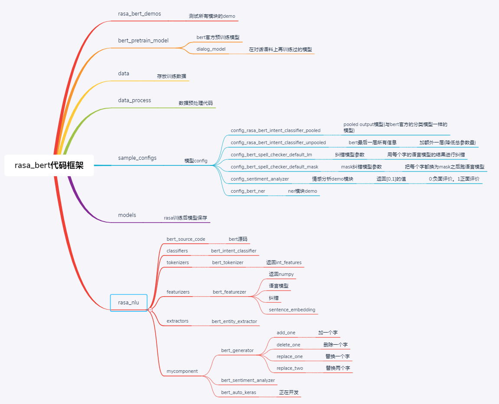
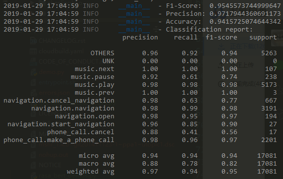

# 基于rasa+bert 搭建NLU模块
将bert作为特征提取器加入到rasa的框架中。
rasa_nlu[介绍](https://github.com/RasaHQ/rasa_nlu)

### 代码结构


### 下载bert预训练模型

```
sh -x getting_bert_pretrain_model.sh
```
如果无法下载，手动下载[模型文件](https://storage.googleapis.com/bert_models/2018_11_03/chinese_L-12_H-768_A-12.zip)加入到目录bert_pretrain_model
### demo
所有模块的demo测试:

```
python rasa_bert_demos.py --model generator_add_one
```
参数:
```
"lm_spell_checker: lm纠错\n"
"mask_spell_checker: mask纠错\n"
"en_spell_checker: 英文纠错(开发中)"
"intent_pooled: pooled intent分类模型\n"
"intent_unpooled: unpooled intent分类模型\n"
"generator_replace_one: 将原句替换一个字生成新的句子\n"
"generator_add_one: 将原句加一个字生成新的句子\n"
"generator_delete_one: 将原句减一个字生成新的句子\n"
"generator_add_one: 将原句加一个字生成新的句子\n"
"generator_replace_two: 将原句替换两个字生成新的句子\n"
"NER: 一个NER demo,还未进行调参等"
"sentiment: 情感分析demo。")
```

### intent classification
#### 数据来源
NLPCC 2018 task4
http://tcci.ccf.org.cn/conference/2018/dldoc/trainingdata04.zip
#### 训练:
有pooled和unpooled两种模型。
pooled总体参数量少，只取第一个token的feature作为句子向量。进行分类
unpooled总体参数量多，使用所有的token的feature，加一层全连接后。进行分类
unpooled:

```
python -m rasa_nlu.train -c sample_configs/config_bert_intent_classifier_unpooled.yml --data data/nlpcc_intent/rasa_nlpcc_train.json --path models --project rasa_bert --fixed_model_name nlpcc_unpooled --verbose
```

pooled:

```
python -m rasa_nlu.train -c sample_configs/config_bert_intent_classifier_pooled.yml --data data/nlpcc_intent/rasa_nlpcc_train.json --path models --project rasa_bert --fixed_model_name nlpcc_pooled --verbose
```

#### 测试:
unpooled:

```
python -m rasa_nlu.evaluate --data  data/nlpcc_intent/rasa_nlpcc_test.json --model models/rasa_bert/nlpcc_unpooled/
```

pooled:

```
python -m rasa_nlu.evaluate --data  data/nlpcc_intent/rasa_nlpcc_test.json --model models/rasa_bert/nlpcc_unpooled/
```

结果:
unpooled:


#### server:
```
python -m rasa_nlu.server --path models/ --port 5001
```

or:

```
python -m rasa_nlu.server --path models/ --pre_load rasa_bert/nlpcc_unpooled/ --port 5001
```


#### curl:
```
curl -XPOST localhost:5001/parse -d '{"q":"怎么报名", "project":"rasa_bert", "model":"nlpcc_unpooled"}'
```


### sentiment analyzer
#### 数据来源
基于bert结果的情感分析模块，
训练数据https://github.com/z17176/Chinese_conversation_sentiment
输出[0,1]的情感得分，0为负面情绪，1为正面情绪

#### 训练:
```
python -m rasa_nlu.train -c sample_configs/config_bert_sentiment.yml --data data/sentiment_analyzer/trainset.json --path models --project sentiment --fixed_model_name sentiment_demo --verbose
```


#### 测试:
```
python -m rasa_nlu.evaluate --data data/sentiment_analyzer/testset.json --model models/sentiment/sentiment_demo
```


#### server:
```
python -m rasa_nlu.server --path models/ --port 5001
```

#### curl:
```
curl -XPOST localhost:5001/parse -d '{"q":"今天天气真是好呀", "project":"sentiment", "model":"sentiment_demo"}'
```


### spell_checker
#### 训练
因为用的是无监督的方法，所以不需要训练，这里跑这训练过程是为了把模型保存下来。
lm模型速度快,gpu下大约20ms一条。在短文本上效果较差。
mask模型速度慢,gpu下大约40ms一条。在短文本上效果比lm好一些，长文本没有明显差别。

lm模型:

```
python -m rasa_nlu.train -c sample_configs/config_bert_spell_checker_default_lm.yml --data ./data/examples/rasa/demo-rasa_zh.json --path models --project spell_checker --fixed_model_name rasa_bert_spell_checker_lm --verbose
```

mask模型:

```
python -m rasa_nlu.train -c sample_configs/config_bert_spell_checker_default_mask.yml --data ./data/examples/rasa/demo-rasa_zh.json --path models --project spell_checker --fixed_model_name rasa_bert_spell_checker_mask --verbose
```


#### server
```
python -m rasa_nlu.server --path models/ --port 5001
```


#### curl
lm模型:
curl -XPOST localhost:5001/parse -d '{"q":"今天真是个好填气啊？", "project":"spell_checker", "model":"rasa_bert_spell_checker_lm"}'
mask模型:
curl -XPOST localhost:5001/parse -d '{"q":"我想听张雨声的哥曲？", "project":"spell_checker", "model":"rasa_bert_spell_checker_mask"}'

### generator
用与spell_checker相似的方法对句子进行生成。输入的句末最好加上标点。可以通过调整参数中的g_score平衡生成句子的数量和质量。g_score越大生成数量越少，质量越高。
#### add_one
从当前句子生成中间多一个字的句子。可以反复调用达到加多个字的功能。
在每个字之间都插入一个[mask],作为一个batch输入，取每个mask处概率值满足一定条件的结果.
- example:
输入一句话: 我想听一首歌

- 生成结果:
'但我想听一首歌', '当我想听一首歌', '我只想听一首歌', '我很想听一首歌', '我最想听一首歌', '我也想听一首歌', '我不想听一首歌', '我想听听一首歌', '我想去听一首歌', '我想要听一首歌', '我想先听一首歌', '我想来听一首歌', '我想听到一首歌', '我想听听一首歌', '我想听的一首歌', '我想听另一首歌', '我想听见一首歌', '我想听一两首歌', '我想听一百首歌', '我想听一千首歌', '我想听一万首歌', '我想听一整首歌', '我想听一首老歌', '我想听一首情歌', '我想听一首好歌', '我想听一首新歌', '我想听一首儿歌', '我想听一首歌的', '我想听一首歌或'
#### replace_one
替换当前句子的一个字。与纠错逻辑相同。只有没有将结果乘上相似矩阵
- example:
我想要听一首老歌
- 生成结果:
['我想听听一首老歌', '我想去听一首老歌', '我想要唱一首老歌', '我想要听一首好歌', '我想要听一首新歌', '我想要听一首情歌']
#### replace_two
替换当前句子中的连续两个字
- example:
今天真是一个好天气呀 / 我想要听儿歌。
- 生成结果
今天真的是个好天气呀 /   ['一、要听儿歌。', '我喜欢听儿歌。', '我想唱首儿歌。', '我想要一首歌。', '我想要听听的。']

#### delete_one
删除当前句子中最不需要的一个字。将当前位置预测的概率值最低的那个字去掉。
可以循环调用用来去除句子中的噪音，可能会误删某些字。效果需要调整。
- example:
啊我想听周杰伦的歌。/ 你在说什么来我听不懂
- result:
我想听周杰伦的歌。/ 你在说什么我听不懂

### NER
数据来自https://github.com/ProHiryu/bert-chinese-ner/tree/master/data
#### 训练
```
python -m rasa_nlu.train -c sample_configs/config_bert_ner.yml --data ./data/ner/bert_ner_train.json --path models --project rasa_bert --fixed_model_name ner_demo --verbose
```


### sentence embedding
- pooled 
直接使用bert官方的pooled_output作为句子向量。使用bert特征提取后的第一个token再加上一层全连接。
- mean 
使用bert特征提取后的所有token的特征的平均值作为句向量。

### 更新bert模型
官方训练的bert的数据来源主要是新闻和百科的数据，日常对话的数据很少，所以对语气词等效果很差。需要输入新的语料进行fine-turing。

```
cd rada_bert_nlu

export BERT_BASE_DIR=./bert_pretrain_model/chinese_L-12_H-768_A-12

python ./rasa_nlu/bert_source_code/create_pretraining_data.py \   --input_file=./data/spell_checker_data/speech_data_little.txt \   --output_file=./tmp/tf_examples2.tfrecord \   --vocab_file=./bert_pretrain_model/chinese_L-12_H-768_A-12/vocab.txt \   --do_lower_case=True \   --max_seq_length=128 \   --max_predictions_per_seq=20 \   --masked_lm_prob=0.15 \   --random_seed=12345 \   --dupe_factor=5

python ./rasa_nlu/bert_source_code/run_pretraining.py \   --input_file=./tmp/tf_examples2.tfrecord \   --output_dir=./tmp/speech_model/ \   --do_train=True \   --do_eval=True \   --bert_config_file=$BERT_BASE_DIR/bert_config.json \   --init_checkpoint=$BERT_BASE_DIR/bert_model.ckpt \   --train_batch_size=32 \   --max_seq_length=128 \   --max_predictions_per_seq=20 \   --num_train_steps=10000 \   --num_warmup_steps=1000 \   --learning_rate=2e-5
```
##### 更新速度
单个gpu，200M语料，10000steps对bert模型重新训练，大约用了一个下午的时间。
##### 更新效果
在官方的bert模型下，对话场景的纠错的准确度大约是90%
在输入200M左右的语料，经过10000step的训练后，准确度是98%，只有少量case会出现错误，是因为训练数据覆盖不全的原因，可以通过强行使用规则进行修正。


### To Do 
intent 分类器训练数据大时内存占用过大。把featurizer的train过程结果保存为.npy,keras部分写data_generator函数。
autoML代替intent 分类
session 传输到下一个模块
binder 部署
bert 英文环境
把其他ner模块提取出的关键词的向量与bert的句子向量concat合成作为输入，进行分类
NLPCC Open Domain Question Answering
用rasa_bert解决NLPCC上所有问题
Automatic Tagging of Zhihu Questions
判断两句话是否有关联(is Next,is not Next)
阅读理解模块
bert模型压缩(官方模型大小是300M,更新训练后大小为.2G)
把max_seq_len变为64测试速度
多任务训练。将其他任务都作为bert重新训练的loss。

### 纠错模型原理
#### bert语言模型与纠错
一般都是使用bert作为一个强大的特征提取器，用于分类等任务，bert的训练过程有两个任务，一个是预测下个句子，另一个是语言模型。在官方文档中并没有使用语言模型这一块的代码
但是其实bert的语言模型的效果是非常强大的，有98.5%的准确率
这个准确率指的是将一个句子中的某个位置的一个词替换为[mask]或者随机的另一个词，模型能够在这个位置准确的预测出原本是原本的这个词。
比如:
原句:今天天气真好
在训练过程中会被替换为:今天[mask]气啊好
而模型训练后能够将替换后的句子还原为原句。
既然这么混乱的句子都可以被还原为原句，很自然的可以想到可以使用这个功能做纠错。
比如语音识别过程中会经常出现识别错误。
但是单纯使用bert的语言模型每个位置的结果是词表中每个字的概率值。而词表有20000个以上
所以你把一个字mask以后鬼知道两万个字中会不会出现某个奇怪的字的概率特别高。
所以要对输出的结果进行修正，去除不想要的结果
这里使用构建相似矩阵(代码中的similar_matrix),即认为每个字只与某些字有关。有关的字为1，无关的为0.
这里认为与原来的字与发音相似和形状相似的字有关。
所以每个字都会有一个只有0,1的大小为|V|的向量。
就可以构造shape[|V|,|V|]的相似矩阵
比如:
输入一句话:
听说塞尔达很好玩
先转为数字表示:
[101, 1420, 6432, 1853, 2209, 6809, 2523, 1962, 4381, 102, 0, 0, 0, 0, 0, 0, 0, 0, 0, 0, 0, 0, 0, 0, 0, 0, 0, 0, 0, 0, 0, 0, 0, 0, 0, 0, 0, 0, 0, 0, 0, 0, 0, 0, 0, 0, 0, 0, 0, 0, 0, 0, 0, 0, 0, 0, 0, 0, 0, 0, 0, 0, 0, 0, 0, 0, 0, 0, 0, 0, 0, 0, 0, 0, 0, 0, 0, 0, 0, 0, 0, 0, 0, 0, 0, 0, 0, 0, 0, 0, 0, 0, 0, 0, 0, 0, 0, 0, 0, 0, 0, 0, 0, 0, 0, 0, 0, 0, 0, 0, 0, 0, 0, 0, 0, 0, 0, 0, 0, 0, 0, 0, 0, 0, 0, 0, 0, 0]
长度为128.
然后进行bert模型抽取特征
得到shape:[128,768]的矩阵。每个字都有一个768维的向量表示
这里使用128是为了让每次运行的结果都有一样的shape，方便后面的操作。但是真正需要的只有8个字的信息
所以语言模型这一步的输入是[8,768]
词表的总大小|V|=21128
一般来说，需要经过一层全连接层，把每个字的768维的信息映射到21128维，然后再进行softmax
但是这样子就需要一个768*21128大小的矩阵，而要学习到这么大的矩阵是很困难的。
因为在bert最开始输入一句话的时候就要先将每个字embedding为一个768的向量。所以这里有一个[768*21128]大小的矩阵。
bert这里就很机智地直接使用了embedding matrix。再加上一个21128大小的可训练的bias项作为调整。
直接就把原本768*21128大小的训练参数降低到了21128。
再经过softmax之后就可以得到了shape [8,21128]的结果。
每一列都代表了当前位置的所有字的概率。这时候的结果的矩阵是稠密的。
先对相似矩阵进行slice，可以得到[8*21128]的只有0,1的稀疏矩阵
直接点乘就可以得到稀疏的[8*21128]的结果矩阵
只需要判断结果的概率值最大的字跟输入的字是否相同，如果不同并且概率最大的字比输入的字的概率大于一定值就可以进行纠错将这个字替换为正确的字了。
这里还会有一个副产物就是整体的语言模型的得分。可以用来判断这句话是否通顺。
目前这一步是没有对输入进行mask，因为bert是基于attention的，所以错误输入的字也有可能对结果进行影响。
如果对输入进行mask效果会更好，特别是对很短的输入，句子中错的字会对bert提取的特征有很大的影响，效果很差。
所以需要对输入进行mask.
比如:
听说塞尔达很好玩
就会变成
听[mask]塞尔达很好玩
听说[mask]尔达很好玩...
所以N个字的句子就会变成N句话，合成一个batch 进行输入

##### 用语言模型进行生成操作
同样的如果担心连续两个字都是错误的话，目前的方案是没法解决的。因为错误的字之间会互相影响。
可以选择一次mask连续的两个字
听说塞尔达很[mask][mask]
这时候加上原本的N个输入会有2N个输入。
如果在这里可以去掉similar_matrix,经过贪心生成，剪枝等操作，就可以得到[mask]处最有可能的结果。从而达到预测接下来的文本的效果。这也是语言模型常见的用法。但是与n-gram不同的是，bert是双向的，所以可以生成中间被mask的词的概率
比如听说[mask][mask][mask]很好玩
可以通过对三个mask的位置的概率最高的结果。这里具体的效果待测试。
这样可以使用bert语言模型生成与当前句子相似的句子，达到扩充数据的效果。
这样生成句子的好处是生成的句子都是语言模型得分高的，也就是语句通顺的。

##### 速度
在单个gpu下没有mask的输入单句话的速度是20ms
有mask时，单句话的速度是40ms.(在server开启的时候速度是100ms??)
在短文本输入下(尤其是5个字以下)mask输入的效果会比没有mask好很多
在长文本下没有明显的差距


